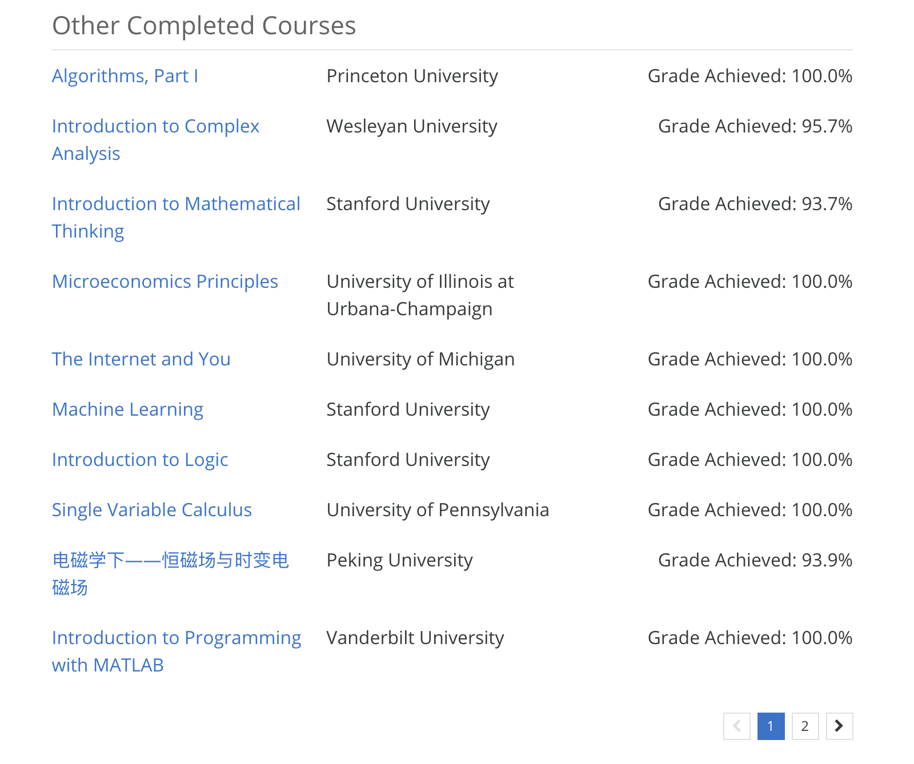

# sample-code
Some code samples that I wrote for assignments of online and offline (at the university) courses, most of which were done in my favorite programming language — Python!

## List of online courses that I have finished

### Coursera
- [Deep Learning Specialization](https://www.coursera.org/specializations/deep-learning) (5 courses) [[certificate]](https://www.coursera.org/account/accomplishments/specialization/BDZPN5UJPHR4)
- [Machine Learning](https://www.coursera.org/learn/machine-learning)
- [Algorithms Part I](https://www.coursera.org/learn/algorithms-part1) [[assignments repo]](Java-Algorithms)
- [Build a Modern Computer from First Principles: From Nand to Tetris (Project-Centered Course)](https://www.coursera.org/learn/build-a-computer) [[certificate]](https://www.coursera.org/account/accomplishments/records/JVDZT8Q3C4SY)
- [Introduction to Logic](https://www.coursera.org/learn/logic-introduction)
- [Microeconomics Principles](https://www.coursera.org/learn/microeconomics)
- Principles of Computing (4 courses) [[certificate]](https://www.coursera.org/account/accomplishments/records/X5VF3XE2UKGK)
- [Python for Everybody Specialization](https://www.coursera.org/specializations/python)
- [Introduction to Programming with MATLAB](https://www.coursera.org/learn/matlab)
- [Introduction to TCP/IP](https://www.coursera.org/learn/tcpip)

### Edx
- [CSMM.101x: Artificial Intelligence](https://www.edx.org/course/artificial-intelligence-ai-columbiax-csmm-101x-4) [[Assignments]](Python) Score: 97%

### Lagunita
- [Statistical Learning](https://lagunita.stanford.edu/courses/HumanitiesSciences/StatLearning/Winter2016/info)

## Accomplishment snapshots

## Online courses in progress

[Discrete Optimization](https://www.coursera.org/learn/discrete-optimization/home/welcome): About 65% progress

[Game Theory](https://www.coursera.org/learn/game-theory-1)

[CSMM.101x: Machine Learning](https://www.edx.org/course/machine-learning-columbiax-csmm-102x-0)

[CVX101: Convex Optimization](https://lagunita.stanford.edu/courses/Engineering/CVX101/Winter2014/info)

[Algorithms Part II](https://www.coursera.org/learn/algorithms-part2): Having gone through the lectures, now doing the programming assignments